# CukaiCopilot — Database ERD

Single all-tables view of the taxpayer database. Source of truth is
[`models.py`](models.py); keep this diagram in sync when models change.

**How to view:** renders automatically on GitHub and in VS Code (with a Mermaid
extension), or paste the block into <https://mermaid.live>.

**Reading it:**
- `||--o{` = one-to-many (parent → child). `|o--o{` = optional one-to-many
  (nullable foreign key). `||--o|` = one-to-one. `|o--o|` = optional one-to-one.
- Everything hangs off **`taxpayers`** — a Malaysian sole proprietorship is not a
  separate taxable entity, so the owner is the root of the whole tree.
- **`documents`** is referenced by many tables via a `document_id` FK — that's the
  evidence/audit thread tying every figure back to a source file.
- Partnerships are intentionally excluded from scope.

```mermaid
erDiagram
    %% ── Root → everything ──────────────────────────────────────────────
    taxpayers ||--o{ businesses        : owns
    taxpayers |o--o| taxpayers         : spouse
    taxpayers ||--o{ consents          : sets
    taxpayers ||--o{ income_sources    : earns
    taxpayers ||--o{ dependents        : claims
    taxpayers ||--o{ relief_claims     : files
    taxpayers ||--o{ business_losses   : incurs
    taxpayers ||--o{ donations         : gives
    taxpayers ||--o{ rebate_claims     : has
    taxpayers ||--o{ tax_computations  : has
    taxpayers ||--o{ tax_obligations   : owes
    taxpayers ||--o{ documents         : uploads
    taxpayers ||--o{ reports           : generates
    taxpayers ||--o{ opportunities     : has
    taxpayers ||--o{ insights          : receives
    taxpayers ||--o{ chat_messages     : sends

    %% ── Business & bookkeeping ─────────────────────────────────────────
    msic_industries          |o--o{ businesses              : classifies
    businesses               ||--o{ transactions            : records
    businesses               ||--o{ capital_assets          : owns
    businesses               |o--o{ business_losses         : source_of
    businesses               |o--o{ documents               : scoped_to
    businesses               |o--o{ opportunities           : scoped_to
    capital_allowance_rates  |o--o{ capital_assets          : rates
    capital_assets           ||--o{ capital_allowance_claims : claimed_via

    %% ── Reliefs ────────────────────────────────────────────────────────
    dependents ||--o{ relief_claims : linked_to

    %% ── Documents = evidence thread ────────────────────────────────────
    documents ||--o| ocr_records    : extracted_by
    documents |o--o{ transactions   : evidences
    documents |o--o{ income_sources : evidences
    documents |o--o{ relief_claims  : evidences
    documents |o--o{ donations      : evidences
    documents |o--o{ rebate_claims  : evidences
    documents |o--o{ capital_assets : evidences
    documents |o--o{ opportunities  : matched_to

    %% ════════════════ ENTITIES ════════════════
    taxpayers {
        int      id PK
        string   email "unique"
        string   password_hash
        string   full_name
        string   phone
        string   nric "unique, nullable"
        string   tin "unique, nullable"
        date     date_of_birth
        string   residency_status
        string   marital_status
        string   assessment_type
        bool     is_disabled
        int      spouse_taxpayer_id FK
        string   preferred_language
        datetime created_at
        datetime updated_at
    }

    consents {
        int      id PK
        int      taxpayer_id FK
        string   scope
        bool     granted
        datetime updated_at
    }

    businesses {
        int      id PK
        int      taxpayer_id FK
        string   name
        string   ssm_registration_no
        string   msic_code FK
        date     accounting_period_start
        date     accounting_period_end
        bool     is_sst_registered
        string   status
        datetime created_at
        datetime updated_at
    }

    transactions {
        int      id PK
        int      business_id FK
        int      year_of_assessment
        date     txn_date
        string   direction "income | expense"
        decimal  amount
        string   category
        bool     is_allowable
        decimal  allowable_pct
        string   source
        decimal  ai_confidence
        string   description
        int      document_id FK
        datetime created_at
    }

    capital_assets {
        int      id PK
        int      business_id FK
        string   description
        string   asset_class FK
        date     acquisition_date
        decimal  cost
        date     disposal_date
        decimal  disposal_value
        int      document_id FK
        datetime created_at
    }

    capital_allowance_claims {
        int      id PK
        int      capital_asset_id FK
        int      year_of_assessment
        decimal  initial_allowance
        decimal  annual_allowance
        decimal  residual_expenditure
        datetime created_at
    }

    income_sources {
        int      id PK
        int      taxpayer_id FK
        int      year_of_assessment
        string   income_type
        decimal  gross_amount
        decimal  mtd_pcb_paid
        int      document_id FK
        datetime created_at
    }

    dependents {
        int      id PK
        int      taxpayer_id FK
        string   relationship_type "spouse | child | parent"
        string   full_name
        string   nric
        date     date_of_birth
        bool     is_disabled
        string   education_status
        bool     is_claimed_by_self
        datetime created_at
    }

    relief_claims {
        int      id PK
        int      taxpayer_id FK
        int      year_of_assessment
        string   relief_code
        int      dependent_id FK
        decimal  amount_claimed
        string   source
        int      document_id FK
        datetime created_at
        datetime updated_at
    }

    business_losses {
        int      id PK
        int      taxpayer_id FK
        int      business_id FK
        int      year_of_assessment
        string   label
        decimal  amount
        datetime created_at
    }

    donations {
        int      id PK
        int      taxpayer_id FK
        int      year_of_assessment
        string   gift_type "G1..G7"
        string   label
        decimal  amount
        int      document_id FK
        datetime created_at
    }

    rebate_claims {
        int      id PK
        int      taxpayer_id FK
        int      year_of_assessment
        string   rebate_type
        decimal  amount
        int      document_id FK
        datetime created_at
    }

    tax_computations {
        int      id PK
        int      taxpayer_id FK
        int      year_of_assessment
        decimal  aggregate_income
        decimal  total_income
        decimal  total_relief
        decimal  chargeable_income
        decimal  tax_before_rebate
        decimal  total_rebate
        decimal  tax_payable
        decimal  tax_without_reliefs
        decimal  relief_savings
        json     result_json
        bool     is_final
        datetime computed_at
    }

    tax_obligations {
        int      id PK
        int      taxpayer_id FK
        int      year_of_assessment
        string   obligation_type "cp500 | pcb | sst | form_b"
        string   label
        int      instalment_no
        date     due_date
        decimal  amount_due
        decimal  amount_paid
        date     paid_date
        string   status
        datetime created_at
    }

    documents {
        int      id PK
        int      taxpayer_id FK
        int      business_id FK
        string   doc_type
        string   file_name
        string   file_url
        string   status
        datetime uploaded_at
    }

    ocr_records {
        int      id PK
        int      document_id FK "unique"
        string   vendor
        string   invoice_number
        decimal  extracted_amount
        date     extracted_date
        decimal  confidence
        json     missing_fields
        string   status
        json     ocr_payload
        datetime created_at
    }

    reports {
        int      id PK
        int      taxpayer_id FK
        string   name
        string   report_type
        int      year_of_assessment
        date     period_start
        date     period_end
        string   status
        decimal  total_amount
        decimal  deductible_amount
        decimal  estimated_tax_impact
        string   file_url
        datetime created_at
        datetime updated_at
    }

    opportunities {
        int      id PK
        int      taxpayer_id FK
        int      business_id FK
        int      year_of_assessment
        string   slug
        string   title
        string   provision
        decimal  estimated_savings
        string   status
        json     why_qualify
        json     calculation_json
        json     legal_reference_json
        int      matched_document_id FK
        decimal  match_confidence
        datetime created_at
        datetime updated_at
    }

    insights {
        int      id PK
        int      taxpayer_id FK
        string   category
        string   title
        text     body
        string   severity
        string   action_label
        string   link
        bool     is_read
        datetime created_at
    }

    chat_messages {
        int      id PK
        int      taxpayer_id FK
        string   session_id
        string   role "user | bot"
        text     content
        json     citations
        datetime created_at
    }

    msic_industries {
        string   code PK
        string   description
        string   category
    }

    capital_allowance_rates {
        string   asset_class PK
        string   description
        decimal  initial_allowance_rate
        decimal  annual_allowance_rate
    }
```

